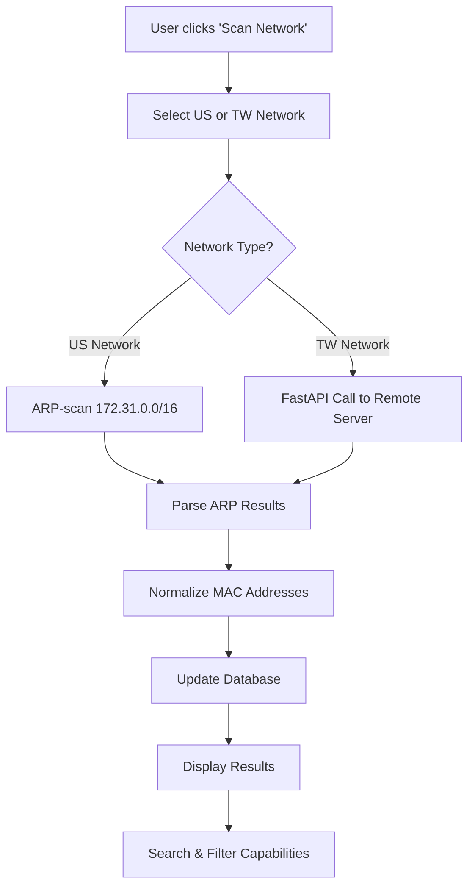
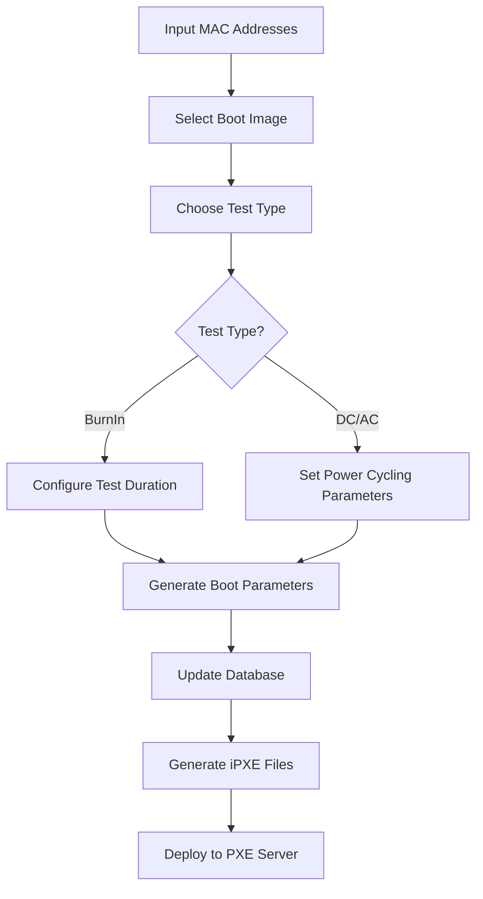
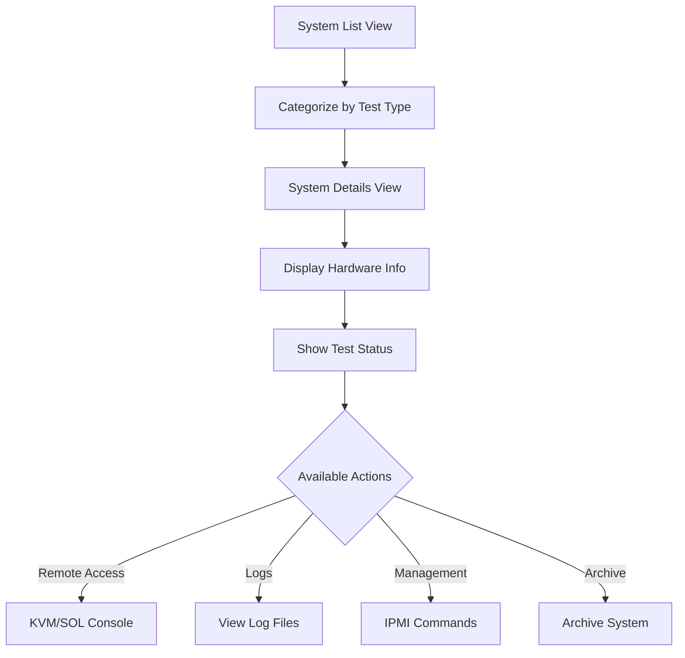
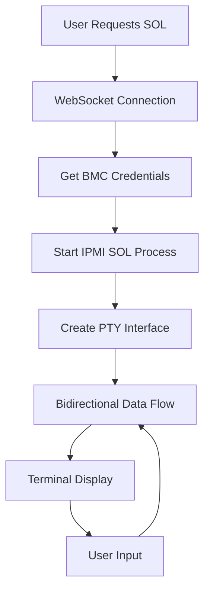

# RD1 Web Application - Comprehensive Documentation

## Table of Contents
1. [Application Overview](#application-overview)
2. [Architecture & Technology Stack](#architecture--technology-stack)
3. [Project Structure](#project-structure)
4. [Core Components](#core-components)
5. [Key Features & Workflows](#key-features--workflows)
6. [Database Schema](#database-schema)
7. [API Endpoints](#api-endpoints)
8. [Authentication & Security](#authentication--security)
9. [Real-time Features](#real-time-features)
10. [Configuration & Deployment](#configuration--deployment)
11. [Code Examples & Patterns](#code-examples--patterns)

---

## Application Overview

**RD1 Web Application** is a comprehensive server management dashboard designed for **Supermicro hardware testing and monitoring**. It provides a unified interface for managing server infrastructure, network boot configurations, remote access, and system monitoring across multiple test environments.

### Primary Purpose
- **Server Management**: Monitor and control Supermicro servers across multiple locations (US, Taiwan)
- **Testing Automation**: Configure and manage various testing scenarios (BurnIn, DC, AC Power Cycling)
- **Remote Access**: Provide KVM and SOL (Serial Over LAN) console access to servers
- **Network Management**: MAC to IP discovery, PXE boot configuration, IPMI tool access
- **System Monitoring**: Track system status, firmware updates, and test progress

---

## Architecture & Technology Stack

### Backend Framework
- **Django 5.2.1**: Main web framework
- **Django Channels**: WebSocket support for real-time features
- **ASGI/Daphne**: Asynchronous server for WebSocket handling
- **PostgreSQL**: Primary database
- **Redis**: Caching and session storage

### Frontend
- **Bootstrap 5.3.0**: UI framework
- **Font Awesome 6.4.0**: Icons
- **JavaScript**: Client-side interactions and WebSocket connections
- **Custom CSS**: Modern, responsive design

### Infrastructure
- **Nginx**: Reverse proxy (production)
- **WebSocket**: Real-time SOL terminal connections
- **IPMI**: Out-of-band server management
- **ARP-scan**: Network discovery
- **PXE Boot**: Network boot management

### External Integrations
- **Supermicro BMCs**: Server management controllers
- **Remote APIs**: Cross-location network scanning
- **File System**: Log file viewing and system data access

---

## Project Structure

```
rd1web-dev/
├── rd1web/                           # Main Django project
│   ├── rd1web/                       # Project configuration
│   │   ├── settings.py               # Django settings
│   │   ├── urls.py                   # Main URL routing
│   │   ├── asgi.py                   # ASGI configuration
│   │   └── wsgi.py                   # WSGI configuration
│   ├── pxe/                          # Main application
│   │   ├── views/                    # View controllers
│   │   │   ├── mac_ip_view.py        # Network discovery
│   │   │   ├── system_details.py     # System management
│   │   │   ├── ipmitool.py           # IPMI operations
│   │   │   ├── firmware_update.py    # Firmware management
│   │   │   └── ...                   # Other features
│   │   ├── models.py                 # Database models
│   │   ├── forms.py                  # Form definitions
│   │   ├── urls.py                   # App URL routing
│   │   ├── consumers.py              # WebSocket consumers
│   │   └── ...
│   ├── authentication/               # User authentication
│   │   ├── models.py                 # User activity tracking
│   │   ├── views.py                  # Auth views
│   │   └── optimized_middleware.py   # Performance middleware
│   ├── templates/                    # HTML templates
│   │   ├── base.html                 # Base template
│   │   ├── features/                 # Feature templates
│   │   └── ...
│   ├── static/                       # Static files (CSS, JS, images)
│   └── manage.py                     # Django management
├── venv/                             # Virtual environment
├── tasks/                            # Project documentation
└── staticfiles/                      # Collected static files
```

---

## Core Components

### 1. **PXE Application** (`rd1web/pxe/`)
The main application containing all server management functionality.

#### Key Models (`models.py`)
```python
# PXE Boot Configuration
class PxeEntry(models.Model):
    mac = models.CharField(max_length=32, unique=True)    # Server MAC address
    parameters = models.TextField()                       # Boot parameters
    image = models.CharField(max_length=100)             # Boot image
    created_at = models.DateTimeField(auto_now_add=True)

# Network Discovery Results
class ArpScanResult(models.Model):
    ip_address = models.GenericIPAddressField()          # Discovered IP
    mac_address = models.CharField(max_length=18)        # MAC address
    hostname = models.CharField(max_length=255)          # System hostname
    subnet_source = models.CharField(max_length=50)      # Network location
    is_active = models.BooleanField(default=True)        # Current status
    first_seen = models.DateTimeField(auto_now_add=True)
    last_seen = models.DateTimeField(auto_now=True)
```

#### Major View Controllers

**MAC-IP Discovery** (`mac_ip_view.py`)
- Network scanning across multiple subnets (US: 172.31.0.0/16, TW: 10.135.0.0/16)
- Enhanced search with multiple MAC address format support
- Real-time scan status updates
- Database-level MAC address normalization

**System Management** (`system_details.py`)
- System categorization (BurnIn, DC, AC testing)
- Hardware information display
- Test status tracking
- File system access to system logs

**IPMI Tool** (`ipmitool.py`)
- Remote server management commands
- Firmware update capabilities
- Password lookup for BMCs
- System reset functionality

### 2. **Authentication System** (`rd1web/authentication/`)

#### User Activity Tracking
```python
class UserActivity(models.Model):
    ACTION_CHOICES = [
        ('login', 'Login'),
        ('page_view', 'Page View'),
        ('pxe_config', 'PXE Configuration'),
        ('system_view', 'System Details View'),
        ('ipmitool_use', 'IPMI Tool Usage'),
        ('kvm_access', 'KVM Access'),
        ('sol_access', 'SOL Access'),
        # ... more actions
    ]
    user = models.ForeignKey(User, on_delete=models.CASCADE)
    action = models.CharField(max_length=20, choices=ACTION_CHOICES)
    timestamp = models.DateTimeField(default=timezone.now)
    ip_address = models.GenericIPAddressField()
```

#### Performance Optimizations
- **Optimized Middleware**: Custom authentication middleware for better performance
- **Database Connection Management**: Explicit connection handling
- **Redis Session Storage**: Fast session management

---

## Key Features & Workflows

### 1. **Network Discovery Workflow**



**Enhanced MAC Search Implementation**:
```python
# Multiple format support: 00:09:0f:09:ac:12, 00090f09ac12, 0009-0f-09-ac-12
# Multiple MAC support: "mac1 mac2" or "mac1,mac2"
search_terms = [term.strip() for term in search_query.replace(',', ' ').split()]
for term in search_terms:
    # Direct matching against stored format
    mac_query |= Q(mac_address__icontains=term)
    
    # Normalized matching (removes all separators)
    normalized_search = re.sub(r'[^a-fA-F0-9]', '', term).lower()
    queryset = queryset.annotate(
        normalized_mac=Replace(Replace('mac_address', Value(':'), Value('')), Value('-'), Value(''))
    )
    mac_query |= Q(normalized_mac__icontains=normalized_search)
```

### 2. **PXE Boot Configuration Workflow**



### 3. **System Management Workflow**



### 4. **Real-time SOL Terminal Workflow**



**WebSocket Consumer Implementation**:
```python
class SOLConsumer(AsyncWebsocketConsumer):
    async def connect(self):
        # Get system configuration
        sysconfig = get_system_sysconfig(self.folder_name)
        bmc_ip = sysconfig['bmc_ip']
        
        # Create SOL session
        self.sol_session = SOLSession(self.folder_name, bmc_ip, bmc_user, bmc_pwd)
        
        # Start SOL process and reading task
        if self.sol_session.start_sol_process():
            self.read_task = asyncio.create_task(self.read_sol_output())
```

---

## Database Schema

### Primary Tables

**PxeEntry** - Boot Configuration
- `mac` (VARCHAR, UNIQUE): Server MAC address
- `parameters` (TEXT): Boot parameters and test configuration
- `image` (VARCHAR): Boot image selection
- `created_at` (TIMESTAMP): Configuration timestamp

**ArpScanResult** - Network Discovery
- `ip_address` (INET): Discovered IP address
- `mac_address` (VARCHAR): MAC address (format: xx:xx:xx:xx:xx:xx)
- `hostname` (VARCHAR): System hostname
- `subnet_source` (VARCHAR): Network location identifier
- `is_active` (BOOLEAN): Current discovery status
- `first_seen` (TIMESTAMP): Initial discovery
- `last_seen` (TIMESTAMP): Last seen timestamp
- **Unique Constraint**: (mac_address, subnet_source)

**UserActivity** - Activity Tracking
- `user_id` (FK): Reference to Django User
- `action` (VARCHAR): Activity type
- `description` (TEXT): Activity details
- `ip_address` (INET): Client IP
- `timestamp` (TIMESTAMP): Activity time

---

## API Endpoints

### Core APIs

| Endpoint | Method | Purpose |
|----------|--------|---------|
| `/api/mac-ip/` | GET | Retrieve network discovery data |
| `/api/mac-ip/scan/` | POST | Trigger network scan |
| `/api/mac-ip/scan/status/` | GET | Check scan progress |
| `/api/systems/summary/` | GET | System overview statistics |
| `/api/systems/<category>/` | GET | Systems by category |

### WebSocket Endpoints

| Endpoint | Purpose |
|----------|---------|
| `/ws/sol/<folder_name>/` | SOL terminal connection |
| `/ws/remote-sol/` | Remote SOL connection |

### Example API Usage

**Trigger Network Scan**:
```javascript
fetch('/api/mac-ip/scan/', {
    method: 'POST',
    headers: {
        'Content-Type': 'application/json',
        'X-CSRFToken': getCookie('csrftoken')
    },
    body: JSON.stringify({network: 'us'})  // or 'tw'
})
```

**WebSocket SOL Connection**:
```javascript
const socket = new WebSocket(`ws://${window.location.host}/ws/sol/${folderName}/`);
socket.onmessage = function(event) {
    const data = JSON.parse(event.data);
    if (data.type === 'data') {
        terminal.write(data.message);
    }
};
```

---

## Authentication & Security

### Security Features
- **CSRF Protection**: Enabled for all state-changing operations
- **Session Management**: Redis-based session storage
- **Login Required**: All views protected with `@login_required`
- **Connection Pooling**: PostgreSQL connection management
- **Input Validation**: Form validation and sanitization

### Performance Optimizations
- **Custom Middleware**: Optimized authentication checks
- **Database Indexing**: Strategic indexes on frequent queries
- **Redis Caching**: Scan status and session caching
- **Connection Management**: Explicit database connection handling

---

## Real-time Features

### WebSocket Architecture
The application uses Django Channels for real-time functionality:

**ASGI Configuration** (`asgi.py`):
```python
application = ProtocolTypeRouter({
    "http": django_asgi_app,
    "websocket": AuthMiddlewareStack(
        URLRouter([
            path('ws/sol/<str:folder_name>/', SOLConsumer.as_asgi()),
            path('ws/remote-sol/', RemoteSOLConsumer.as_asgi()),
        ])
    ),
})
```

### SOL Terminal Implementation
- **PTY Management**: Pseudo-terminal for IPMI SOL processes
- **Asynchronous I/O**: Non-blocking terminal data flow
- **Error Handling**: Connection failure recovery
- **Session Management**: Per-system SOL sessions

---

## Configuration & Deployment

### Multi-Worker Deployment
The application supports multiple Daphne workers for scalability:

```python
# run_server.py - Production deployment
workers = 4  # Recommended for production
start_port = 8000
# Creates workers on ports 8000, 8001, 8002, 8003
```

### Environment Configuration
- **Database**: PostgreSQL (172.31.60.129:5432)
- **Redis**: Local Redis instance (127.0.0.1:6379)
- **Static Files**: Nginx serves static content
- **WebSocket**: Proxied through Nginx

### Network Configuration
- **US Network**: 172.31.0.0/16 (eno1 interface)
- **TW Network**: 10.135.0.0/16 (FastAPI endpoint)
- **BMC Access**: Direct IPMI connections to server BMCs

---

## Code Examples & Patterns

### Enhanced Search Pattern
```python
# Pattern: Flexible search with multiple format support
def build_search_query(search_query):
    search_terms = [term.strip() for term in search_query.replace(',', ' ').split()]
    query = Q()
    
    for term in search_terms:
        # Direct matching
        query |= Q(field__icontains=term)
        
        # Normalized matching
        normalized = normalize_input(term)
        if normalized:
            query |= Q(normalized_field__icontains=normalized)
    
    return query
```

### Database Annotation Pattern
```python
# Pattern: Runtime field transformation for flexible queries
queryset = queryset.annotate(
    normalized_mac=Replace(Replace('mac_address', Value(':'), Value('')), Value('-'), Value(''))
)
```

### Async WebSocket Pattern
```python
# Pattern: Asynchronous data streaming
class DataConsumer(AsyncWebsocketConsumer):
    async def connect(self):
        await self.accept()
        self.read_task = asyncio.create_task(self.read_data())
    
    async def read_data(self):
        while self.connected:
            data = await self.get_data()
            await self.send(text_data=json.dumps(data))
```

### Error Handling Pattern
```python
# Pattern: Comprehensive error handling with user feedback
try:
    result = perform_operation()
    return JsonResponse({'success': True, 'data': result})
except SpecificException as e:
    logger.error(f"Operation failed: {str(e)}")
    return JsonResponse({'success': False, 'error': str(e)}, status=400)
except Exception as e:
    logger.error(f"Unexpected error: {str(e)}")
    return JsonResponse({'success': False, 'error': 'Internal server error'}, status=500)
```

---

## Development Guidelines

### Code Organization
- **Single Responsibility**: Each view handles one specific functionality
- **Separation of Concerns**: Views, models, and templates clearly separated
- **Reusable Components**: Common patterns extracted into utilities
- **Error Handling**: Comprehensive error handling at all levels

### Performance Considerations
- **Database Queries**: Optimized with appropriate annotations and filtering
- **Caching**: Redis used for frequently accessed data
- **Async Operations**: WebSocket consumers use async patterns
- **Static Files**: Served efficiently through Nginx

### Security Best Practices
- **Input Validation**: All user inputs validated and sanitized
- **Authentication**: All views require authentication
- **CSRF Protection**: All forms include CSRF tokens
- **SQL Injection Prevention**: Django ORM used exclusively

This documentation provides a comprehensive overview of the RD1 Web Application architecture, components, and workflows. The application demonstrates modern Django development practices with real-time features, performance optimizations, and comprehensive server management capabilities. 